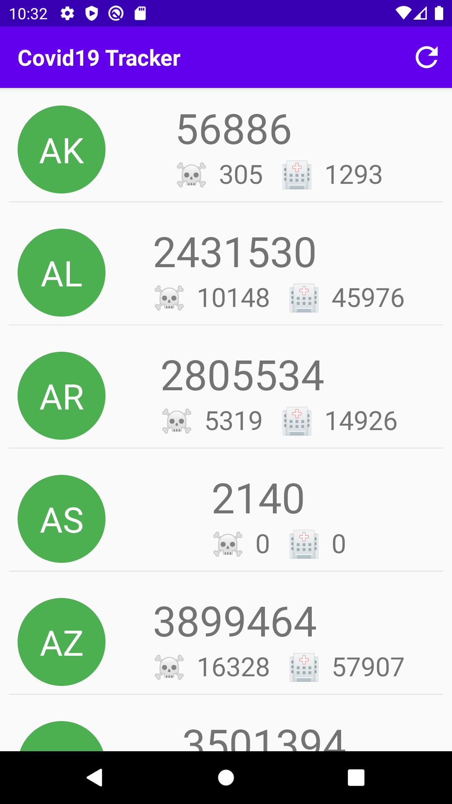

# KMM_COVID-19_Tracker 
This project uses Kotlin Multiplatform Mobile. A shared KMM module is generated which can be imported in iOS and Android app thereby reducing efforts to write business logic on each respective platforms. We only need to develop UI for both platforms and wireup the shared framework.

### iOS Client Screenshot
  

### Android Client Screenshot

  
